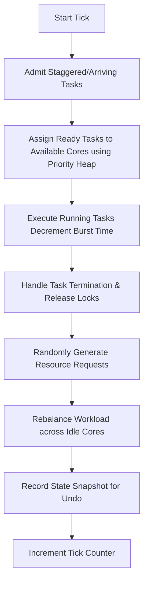

# CoreSched Simulator: Project Details & Technical Concepts

This document provides a comprehensive overview of the CoreSched Simulator, explaining its architecture, individual components, the core algorithms, and the underlying computer science concepts implemented in the application.

---

## 1. Project Concept & Architecture

The **CoreSched Simulator** is an interactive web-based simulator designed to visualize how a modern multi-core CPU handles task (thread) scheduling, priority management, state undo/redo (context switching), resource locking, and deadlock detection.

### Key Objectives
*   **Visualization**: Show the real-time movement of threads through different state lifecycles (Ready, Running, Waiting, Blocked, Terminated).
*   **Interactivity**: Allow the user to step through time, pause/resume, add custom tasks, query task security, and restore past execution states.
*   **Demonstration of Core OS Concepts**: Visually explain priority heaps, FIFO queues, resource contention, topological sort, and deadlock cycles.

---

## 2. Technical Stack & File Directory

The project is built as a Single Page Application (SPA) using React, TailwindCSS, and Vite.

### Key Files & Directory Structure
*   **[`src/lib/SimulationEngine.js`](file:///Users/subratapanda/Desktop/CoreSched/src/lib/SimulationEngine.js)**: The core state machine of the simulator. Manages the system tick, schedules tasks, handles resource requests/releases, and tracks historical snapshots.
*   **[`src/lib/PriorityHeap.js`](file:///Users/subratapanda/Desktop/CoreSched/src/lib/PriorityHeap.js)**: A custom Min-Heap data structure used for priority-based scheduling. Tasks with higher priority (lower numeric value, e.g., 1 is highest) are selected first.
*   **[`src/lib/TaskIdChecker.js`](file:///Users/subratapanda/Desktop/CoreSched/src/lib/TaskIdChecker.js)**: A hash-map-based security ID validator offering $O(1)$ constant time lookup for running tasks.
*   **[`src/lib/DeadlockDetector.js`](file:///Users/subratapanda/Desktop/CoreSched/src/lib/DeadlockDetector.js)**: A cycle detection algorithm that builds a wait-for graph of resource dependencies and runs Depth-First Search (DFS) to identify deadlock cycles. Also performs topological sorting to recommend a recovery sequence.
*   **[`src/hooks/useSimulation.js`](file:///Users/subratapanda/Desktop/CoreSched/src/hooks/useSimulation.js)**: A custom React hook that bridges the vanilla JS `SimulationEngine` with the reactive React state system.
*   **[`src/components/CoreSchedDashboard.jsx`](file:///Users/subratapanda/Desktop/CoreSched/src/components/CoreSchedDashboard.jsx)**: The central dashboard rendering the control panel, core load status, task list, and detail tabs.
*   **[`src/components/LandingPage.jsx`](file:///Users/subratapanda/Desktop/CoreSched/src/components/LandingPage.jsx)**: The beautiful entry page explaining CoreSched concepts with animated cards, a fixed navigation header, and a CTA button to launch the simulator.
*   **[`src/components/CardSwap.jsx`](file:///Users/subratapanda/Desktop/CoreSched/src/components/CardSwap.jsx)**: A custom swappable card stack component that utilizes framer-motion to transition tasks/concepts.

---

## 3. Core Simulation Loop (The Tick)

At every tick (step), the simulation engine transitions the processor through the following phases:

1.  **Arriving Tasks**: Tasks whose `arrivalTime` is equal to or less than the current tick are transitioned from `waiting` to `ready`.
2.  **Scheduling**: For each idle core, the simulator extracts the highest-priority task from the Min-Heap.
3.  **Execution**: Tasks currently assigned to cores run, decrementing their remaining burst time by 1.
4.  **Completion**: When a task's remaining burst time hits 0, it is marked as `terminated`. All resources held by this task are released, and any tasks waiting for those resources are unblocked.
5.  **Workload Balancer**: Idle cores pull ready tasks from the queue to maximize CPU utilization.

---

## 4. Implementation of Case Study Requirements

### A. Task Status List (Status Tab)
*   **Concept**: Shows the state of all tasks currently in the system.
*   **Implementation**: Fully interactive table showing ID, Name, Status (Running, Ready, Waiting, Blocked, Terminated), Priority, assigned CPU Core, remaining Burst Time, and resources held.

### B. CPU State Undo (Undo Tab)
*   **Concept**: Safely rollback context switches.
*   **Implementation**: On every tick, the simulator saves a snapshot of:
    *   CPU Core assignment and history.
    *   Register values (simulated `PC`, `SP`, and `FLAGS`).
    *   All task states.
    *   Resource ownership mapping.
    Users can click **Restore** on any historic tick to rewind the simulator safely.

### C. Task Waiting Line (Queue Tab)
*   **Concept**: A First-In-First-Out (FIFO) queue for task admission.
*   **Implementation**: Visual queue displaying tasks in the order they arrived or requested execution.

### D. Task ID Checker (Control Panel)
*   **Concept**: Securely lookup active task metadata.
*   **Implementation**: Uses `TaskIdChecker` with a JS `Map` object to provide instant $O(1)$ lookup. Inputting a security ID (e.g., `SEC-XXXX`) returns task status, name, and current core ID.

### E. Priority Sorter (Priority Tab)
*   **Concept**: Ensure critical tasks execute first.
*   **Implementation**: Powered by `PriorityHeap.js`, displaying all active tasks sorted by priority (1 to 10). If two tasks have the same priority, the heap resolves them.

### F. Resource Lock Map (Locks Tab)
*   **Concept**: Avoid resource conflict.
*   **Implementation**: A grid mapping CPU resources (such as `Mem_Block_1`, `File_A`, `Network_Socket`) to tasks. Displays a lock icon if a task currently holds the resource.

### G. Deadlock Finder (Deadlock Tab)
*   **Concept**: Find and resolve circular wait states.
*   **Implementation**: The detector constructs a dependency graph (Task A waits for Resource X held by Task B, Task B waits for Resource Y held by Task A). It analyzes this graph to find cycles:
    *   **Graph Visualization**: Renders an SVG Wait-For Graph showing cycle connections in red.
    *   **Resolution**: Executes a Topological Sort to calculate the optimal order to release locks to resolve contention without freezing the system.

### H. Workload Balancer
*   **Concept**: Distribute thread load evenly.
*   **Implementation**: Visual bar charts show core load percentage and utilization history. If a core completes its task, it immediately fetches the next ready task.

---

## 5. Potential Enhancements & Next Steps

If you want to expand the project further, here are a few recommended features:
1.  **Multiple Scheduling Algorithms**: Add dropdowns to switch between Priority, First-Come-First-Served (FCFS), Round Robin (RR), and Shortest Job First (SJF).
2.  **Custom Resource Creator**: Add a panel to let users define custom resource names (e.g., database instances) and manually request locks during playback.
3.  **Performance Graphs**: A line chart showing real-time CPU Utilization and throughput over time.

---

## 6. Viva Cheat Sheet: Project Overview, Usage, & React Concepts

This section contains a direct summary of the key questions you might face during your viva exam, detailing what the project is, how to use it, the technologies involved, and the ReactJS concepts used to implement it.

### A. Quick Pitch (Overview)
- **What is CoreSched?** CoreSched is a multi-core operating system simulator that visualizes thread scheduling, priority queue execution, resource lock contention, and deadlock detection.
- **Why was it built?** To provide an interactive, visual representation of core OS concepts like CPU scheduling queues, registers, wait-for cycle graphs, and context-switching rollbacks.
- **Key Tabs in the Dashboard**:
  - **Status**: Visualizes the active thread list, their core allocation, burst remaining, and current status.
  - **Queue**: A visual FIFO (First-In-First-Out) queue displaying ready tasks awaiting CPU time.
  - **Priority**: A list of active tasks sorted by priority level (1 to 10), powered by a binary min-heap.
  - **Locks**: A resource lock grid showing memory blocks, files, and sockets held by active tasks.
  - **Deadlock**: Cycle graph builder running DFS cycle detection, suggesting recovery sequence via topological sorting.
  - **Undo**: History of CPU snapshots allowing users to rollback execution ticks.
  - **Stats**: Summary performance statistics (throughput, core utilization).

### B. How to Use the Simulator
1. **Launch**: Click **Launch Simulator** on the Landing Page. Click **CoreSched Simulator** at the top of the dashboard at any time to return.
2. **Execute Ticks**: Click **Start** to play the simulation continuously, or click **Step** (SkipForward icon) to execute one clock tick at a time. Change tick duration with the speed slider.
3. **Change Cores**: Adjust the simulated core count (1, 2, 4, or 8) from the dropdown.
4. **Create Tasks**: Click the **+** (Plus) icon in the tasks header to admit a custom task (specify name, priority, and burst time).
5. **Lookup Task**: Enter a task's security ID (e.g. `SEC-XXXX`) in the Task ID Checker search bar for instant lookup.
6. **Trigger Deadlock**: The simulation naturally generates resource requests. In the **Deadlock** tab, observe if any cycles are detected in red, and view the optimal release order.
7. **Rollback State**: Go to the **Undo** tab and click **Restore** on a previous tick index to rewind the simulation's state.

### C. Technology Breakdown (Which is Used How)
*   **ReactJS (v18)**: Powering the component architecture, page transitions, and overall state synchronization.
*   **TailwindCSS**: Used for premium visual design, HSL colors, responsive layouts, glassmorphism, and custom UI styling.
*   **Framer Motion**: Powering smooth micro-animations, transitions, card swapping, and table updates.
*   **Lucide React**: Provides slick, premium vector icons for buttons and status indicators.
*   **Sonner**: Renders elegant, non-intrusive toast notifications for success/error alerts.
*   **Custom Vanilla JavaScript Engine**:
    - `SimulationEngine.js`: Controls simulation ticking, CPU scheduling loops, and snapshots.
    - `PriorityHeap.js`: Implements a standard binary Min-Heap data structure to sort tasks.
    - `DeadlockDetector.js`: Implements DFS cycle detection on a directed dependency graph, and Topological Sort for cycle resolution.
    - `TaskIdChecker.js`: Implements a JavaScript Map hash-table to enable $O(1)$ task lookups.

### D. ReactJS Core Concepts Mapping
During your viva, map these React concepts directly to the codebase:
1. **Functional Components & JSX**: All UI code (e.g., [`App.jsx`](file:///Users/subratapanda/Desktop/CoreSched/src/App.jsx), [`LandingPage.jsx`](file:///Users/subratapanda/Desktop/CoreSched/src/components/LandingPage.jsx), [`CoreSchedDashboard.jsx`](file:///Users/subratapanda/Desktop/CoreSched/src/components/CoreSchedDashboard.jsx)) is built using modular React functional components returning JSX.
2. **State Management (`useState`)**:
   - Used in `App.jsx` (`showSimulator`) to handle conditional page routing.
   - Used in `CoreSchedDashboard.jsx` (`popoverOpen`, `newTask`, `idQuery`) to track temporary user forms and search queries.
   - Used in [`useSimulation.js`](file:///Users/subratapanda/Desktop/CoreSched/src/hooks/useSimulation.js) (`tasks`, `readyQueue`, `isRunning`, `speed`, `cores`) to hold simulation data and trigger re-renders.
3. **Reference Hook (`useRef`)**:
   - Used in `useSimulation.js` (`engineRef`) to instantiate and persist the single `SimulationEngine` object. Using a ref ensures the engine's internal state survives React re-renders without being reset.
   - Used in `useSimulation.js` (`intervalRef`) to hold the auto-play timer reference for cleanup.
4. **Effect Hook (`useEffect`)**:
   - Used in `useSimulation.js` to manage the simulation loop interval: it registers a `setInterval` when `isRunning` is true, executes a tick every `speed` milliseconds, and returns a cleanup function calling `clearInterval` when paused or unmounted to prevent memory leaks.
5. **Memoization (`useMemo`, `useCallback`)**:
   - Used in `CoreSchedDashboard.jsx` (`idResult`) to memoize search lookups. The calculation only re-runs if `idQuery`, `tasks`, or the `checkTaskId` function changes, saving rendering performance.
   - Used in `useSimulation.js` to wrap action functions (`step`, `start`, `pause`, `undo`) with `useCallback` to prevent unnecessary component updates.
6. **Component Memoization (`React.memo`)**:
   - Used in `LandingPage.jsx` (`Navigation`, `Hero`) to wrap static page sections so they do not re-render when the parent page's minor state updates.
7. **Props & State Lifting**:
   - The landing page takes `onLaunch` as a prop from `App.jsx`.
   - The simulator dashboard takes `onBack` as a prop from `App.jsx`.
   - Clicking these buttons updates the parent state in `App.jsx`, demonstrating simple state lifting.
8. **Suspense & Code Splitting (`React.lazy`)**:
   - Used in `App.jsx` to load `CoreSchedDashboard` lazily. This ensures that the landing page loads instantly, downloading the heavy dashboard code only when the user clicks **Launch Simulator**.
