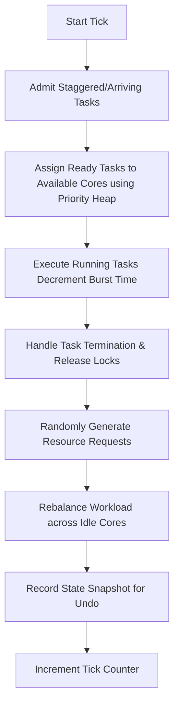

# CoreSched Simulator: Project Details & Technical Concepts

This document provides a comprehensive overview of the CoreSched Simulator, explaining its architecture, individual components, the core algorithms, and the underlying computer science concepts implemented in the application.

---

## 1. Project Concept & Architecture

The **CoreSched Simulator** is an interactive web-based simulator designed to visualize how a modern multi-core CPU handles task (thread) scheduling, priority management, state undo/redo (context switching), resource locking, and deadlock detection.

### Key Objectives
*   **Visualization**: Show the real-time movement of threads through different state lifecycles (Ready, Running, Waiting, Blocked, Terminated).
*   **Interactivity**: Allow the user to step through time, pause/resume, add custom tasks, query task security, and restore past execution states.
*   **Demonstration of Core OS Concepts**: Visually explain priority heaps, FIFO queues, resource contention, topological sort, and deadlock cycles.

---

## 2. Technical Stack & File Directory

The project is built as a Single Page Application (SPA) using React, TailwindCSS, and Vite.

### Key Files & Directory Structure
*   **[`src/lib/SimulationEngine.js`](file:///Users/subratapanda/Desktop/SchedulingAlgorithmSimulator%20copy/src/lib/SimulationEngine.js)**: The core state machine of the simulator. Manages the system tick, schedules tasks, handles resource requests/releases, and tracks historical snapshots.
*   **[`src/lib/PriorityHeap.js`](file:///Users/subratapanda/Desktop/SchedulingAlgorithmSimulator%20copy/src/lib/PriorityHeap.js)**: A custom Min-Heap data structure used for priority-based scheduling. Tasks with higher priority (lower numeric value, e.g., 1 is highest) are selected first.
*   **[`src/lib/TaskIdChecker.js`](file:///Users/subratapanda/Desktop/SchedulingAlgorithmSimulator%20copy/src/lib/TaskIdChecker.js)**: A hash-map-based security ID validator offering $O(1)$ constant time lookup for running tasks.
*   **[`src/lib/DeadlockDetector.js`](file:///Users/subratapanda/Desktop/SchedulingAlgorithmSimulator%20copy/src/lib/DeadlockDetector.js)**: A cycle detection algorithm that builds a wait-for graph of resource dependencies and runs Depth-First Search (DFS) to identify deadlock cycles. Also performs topological sorting to recommend a recovery sequence.
*   **[`src/hooks/useSimulation.js`](file:///Users/subratapanda/Desktop/SchedulingAlgorithmSimulator%20copy/src/hooks/useSimulation.js)**: A custom React hook that bridges the vanilla JS `SimulationEngine` with the reactive React state system.
*   **[`src/components/CoreSchedDashboard.jsx`](file:///Users/subratapanda/Desktop/SchedulingAlgorithmSimulator%20copy/src/components/CoreSchedDashboard.jsx)**: The central dashboard rendering the control panel, core load status, task list, and detail tabs.

---

## 3. Core Simulation Loop (The Tick)

At every tick (step), the simulation engine transitions the processor through the following phases:

1.  **Arriving Tasks**: Tasks whose `arrivalTime` is equal to or less than the current tick are transitioned from `waiting` to `ready`.
2.  **Scheduling**: For each idle core, the simulator extracts the highest-priority task from the Min-Heap.
3.  **Execution**: Tasks currently assigned to cores run, decrementing their remaining burst time by 1.
4.  **Completion**: When a task's remaining burst time hits 0, it is marked as `terminated`. All resources held by this task are released, and any tasks waiting for those resources are unblocked.
5.  **Workload Balancer**: Idle cores pull ready tasks from the queue to maximize CPU utilization.

---

## 4. Implementation of Case Study Requirements

### A. Task Status List (Status Tab)
*   **Concept**: Shows the state of all tasks currently in the system.
*   **Implementation**: Fully interactive table showing ID, Name, Status (Running, Ready, Waiting, Blocked, Terminated), Priority, assigned CPU Core, remaining Burst Time, and resources held.

### B. CPU State Undo (Undo Tab)
*   **Concept**: Safely rollback context switches.
*   **Implementation**: On every tick, the simulator saves a snapshot of:
    *   CPU Core assignment and history.
    *   Register values (simulated `PC`, `SP`, and `FLAGS`).
    *   All task states.
    *   Resource ownership mapping.
    Users can click **Restore** on any historic tick to rewind the simulator safely.

### C. Task Waiting Line (Queue Tab)
*   **Concept**: A First-In-First-Out (FIFO) queue for task admission.
*   **Implementation**: Visual queue displaying tasks in the order they arrived or requested execution.

### D. Task ID Checker (Control Panel)
*   **Concept**: Securely lookup active task metadata.
*   **Implementation**: Uses `TaskIdChecker` with a JS `Map` object to provide instant $O(1)$ lookup. Inputting a security ID (e.g., `SEC-XXXX`) returns task status, name, and current core ID.

### E. Priority Sorter (Priority Tab)
*   **Concept**: Ensure critical tasks execute first.
*   **Implementation**: Powered by `PriorityHeap.js`, displaying all active tasks sorted by priority (1 to 10). If two tasks have the same priority, the heap resolves them.

### F. Resource Lock Map (Locks Tab)
*   **Concept**: Avoid resource conflict.
*   **Implementation**: A grid mapping CPU resources (such as `Mem_Block_1`, `File_A`, `Network_Socket`) to tasks. Displays a lock icon if a task currently holds the resource.

### G. Deadlock Finder (Deadlock Tab)
*   **Concept**: Find and resolve circular wait states.
*   **Implementation**: The detector constructs a dependency graph (Task A waits for Resource X held by Task B, Task B waits for Resource Y held by Task A). It analyzes this graph to find cycles:
    *   **Graph Visualization**: Renders an SVG Wait-For Graph showing cycle connections in red.
    *   **Resolution**: Executes a Topological Sort to calculate the optimal order to release locks to resolve contention without freezing the system.

### H. Workload Balancer
*   **Concept**: Distribute thread load evenly.
*   **Implementation**: Visual bar charts show core load percentage and utilization history. If a core completes its task, it immediately fetches the next ready task.

---

## 5. Potential Enhancements & Next Steps

If you want to expand the project further, here are a few recommended features:
1.  **Multiple Scheduling Algorithms**: Add dropdowns to switch between Priority, First-Come-First-Served (FCFS), Round Robin (RR), and Shortest Job First (SJF).
2.  **Custom Resource Creator**: Add a panel to let users define custom resource names (e.g., database instances) and manually request locks during playback.
3.  **Performance Graphs**: A line chart showing real-time CPU Utilization and throughput over time.
4.  **Landing Page**: A beautiful entry page explaining scheduling algorithms before entering the simulator dashboard.
