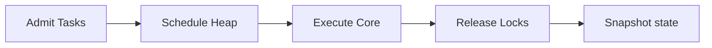

# CoreSched Simulator

[](https://vitejs.dev/)
[](https://reactjs.org/)
[](https://tailwindcss.com/)
[](https://www.framer.com/motion/)

CoreSched is an interactive, modern web-based operating system simulator. It is designed to visualize and demonstrate core OS scheduler concepts, thread lifecycles, priority-based preemptive execution, workload balancing, resource locks, deadlock occurrences, and CPU state context rollbacks.

By separating the visual React layer from pure vanilla JavaScript computational algorithms, CoreSched provides high-performance scheduling simulation directly in your browser.

---

## Architectural Flow

Here is the simplified flow of the simulator engine at each execution clock tick:



---

## Core Features

*   **Priority-Based CPU Scheduling**
    
    Uses a custom binary Min-Heap (PriorityHeap.js) to schedule tasks based on priority numbers (where Priority 1 is the highest). Ties are resolved in First-In, First-Out order.

*   **FIFO Ready Queue**
    
    Tracks tasks in a horizontal, First-In, First-Out queue, showing the precise order of threads awaiting CPU core allocation.

*   **Fast Task ID Security Checker**
    
    Implements a hash-map lookup table (TaskIdChecker.js) enabling O(1) constant-time validation of task security IDs (SEC-XXXX).

*   **Deadlock Detection and Recovery**
    
    Builds a Wait-For Graph (WFG) from active resource locks, using DFS with three-color node markings (White, Gray, Black) to detect cycles, and Kahn's algorithm to determine the optimal lock release order.

*   **CPU State Rollback**
    
    Captures deep-cloned snapshots of active tasks, cores, locks, and simulated CPU registers (PC, SP, FLAGS) on every tick, allowing full restoration of history.

*   **Workload Balancer**
    
    Distributes ready threads to the CPU core with the lowest total busy-ticks record to optimize core utilization.

*   **Resource Lock Grid**
    
    Visualizes resource contention on shared variables (memory blocks, files, and sockets) held by active threads.

---

## Technology Stack

*   Frontend Library: React (v18)
*   Build Tool: Vite (v5)
*   Styling: Tailwind CSS (v3) and CSS variables (HSL tailored color palettes)
*   Animations: Framer Motion and GSAP (for smooth layouts and card sweeps)
*   Icons: Lucide React
*   Routing: React Router DOM (v7)
*   Toasts: Sonner

---

## Project Structure

```text
CoreSched/
├── public/                  # Static assets
├── src/
│   ├── components/
│   │   ├── ui/              # Reusable shadcn/ui components (cards, tables, buttons)
│   │   ├── CardSwap.jsx     # Swappable conceptual landing cards
│   │   ├── CoreSchedDashboard.jsx # Central simulator UI & tab panels
│   │   ├── LandingPage.jsx  # Interactive welcome dashboard
│   │   ├── footer.jsx       # Layout footer
│   │   └── theme-provider.jsx # Light/dark mode context provider
│   ├── hooks/
│   │   └── useSimulation.js # Custom hook wrapping SimulationEngine
│   ├── lib/
│   │   ├── DeadlockDetector.js # Wait-For Graph, DFS, and Kahn's algorithm
│   │   ├── PriorityHeap.js     # Binary Min-Heap priority queue
│   │   ├── SimulationEngine.js # Core scheduler state machine and tick loop
│   │   ├── TaskIdChecker.js    # Map-based O(1) security ID lookup
│   │   └── utils.js            # Tailwind merge utility
│   ├── App.jsx              # App root component and routes
│   ├── index.css            # Global CSS styles and Tailwind configurations
│   └── main.jsx             # React DOM entry mount point
├── LICENSE                  # MIT License
├── PROJECT_DETAILS.md       # Detailed technical concepts documentation
├── VIVA_PREPARATION.md      # Comprehensive Viva Q&As and presentation prep guide
├── tailwind.config.js       # Tailwind theme configuration
├── vite.config.js           # Vite server settings
└── package.json             # NPM project scripts and dependency list
```

---

## Local Setup and Execution

Follow these steps to run the project locally on your machine.

### Prerequisites

*   Node.js: Make sure you have Node.js installed (v18 or higher recommended). Check version with:
    ```bash
    node -v
    ```
*   NPM: Node package manager (comes pre-installed with Node).

### Installation Instructions

1.  Clone the Repository
    ```bash
    git clone https://github.com/subratapanda24/coresched-simulator.git
    cd CoreSched
    ```

2.  Install Dependencies
    ```bash
    npm install
    ```

3.  Start the Local Dev Server
    ```bash
    npm run dev
    ```
    This starts the Vite server locally (typically at http://localhost:5173). Open the URL in your web browser.

4.  Build for Production
    To package the app into optimized static files for deployment, run:
    ```bash
    npm run build
    ```
    The output assets will be generated inside the /dist folder.

5.  Preview Production Build Locally
    ```bash
    npm run preview
    ```

---

## User Interface and Screenshots

Here is a look at the interactive panels included in the dashboard:

| Section | Description |
| :--- | :--- |
| Control Panel | Hosts simulation tick speed sliders, CPU core count dropdowns, manual task addition forms, and the O(1) security lookup tool. |
| Workload Balancer | Displays animated real-time utilization graphs for active CPU cores. |
| Status Grid | Renders thread properties, including remaining execution burst cycles and lock ownership. |
| Ready Queue | A horizontal queue displaying waiting tasks in arrival order. |
| Deadlock Graph | Visualizes dependency loops in red using a circular SVG node layout. |
| State Undo Log | Lists context snapshots with registers (PC, SP, FLAGS) and a button to restore state. |

---

## Live Demo and Deployment

*   Live Simulator URL: [https://coresched-simulator.netlify.app/](https://coresched-simulator.netlify.app/)

---

## License

This project is licensed under the MIT License - see the [LICENSE](file:///Users/subratapanda/Desktop/CoreSched/LICENSE) file for details.
